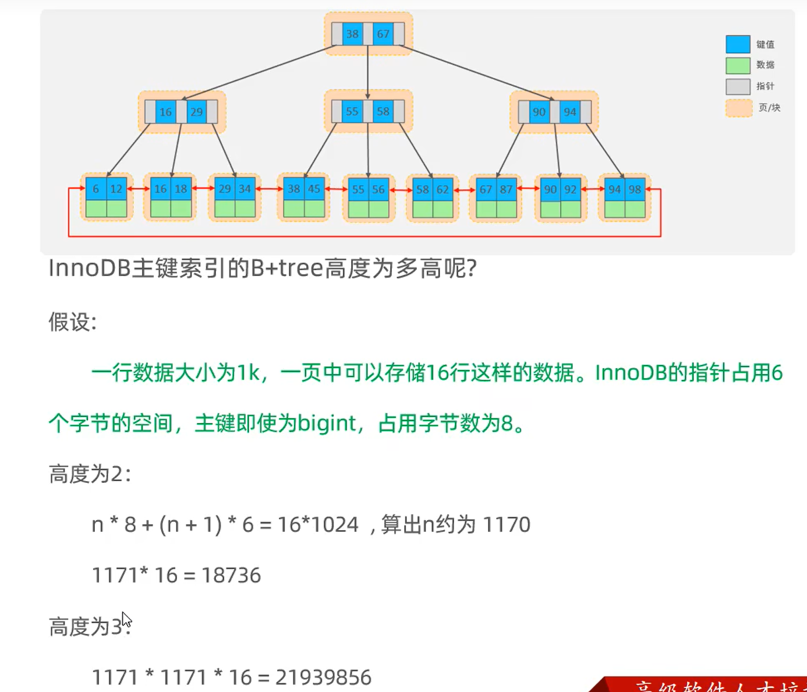

## MySql的存储结构

B+树

## 索引的分类

## 思考1

通过上面聚集索引和二级索引，可以得出是【select * from user where id = 10】比较快

因为id去比只需要比一次，而name通过二级索引会先找到id，然后再找到 * 

找了2次，就慢了

## 思考2

* 一页【一个节点】可以存储16k
* 一个指针占用6个字节
* 主键int占用4，bigint占用8

n * 8  代表的是主键

(n + 1) * 6 代表的是指针 因为指针比主键多一个