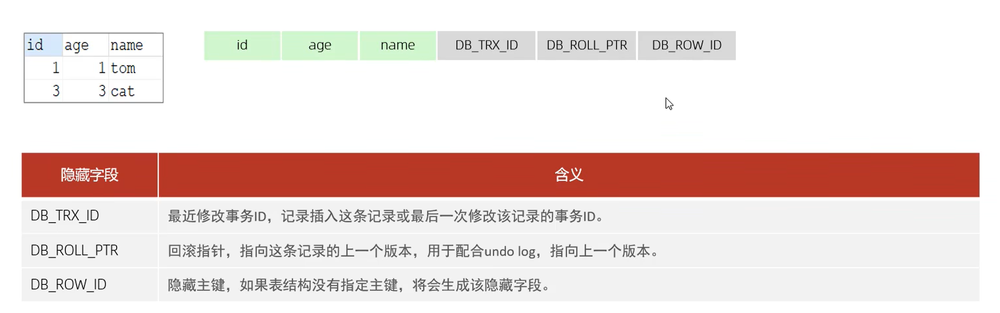
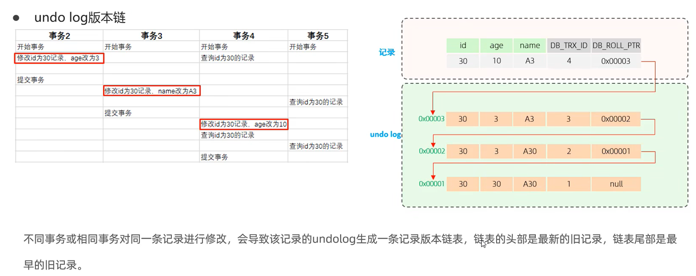
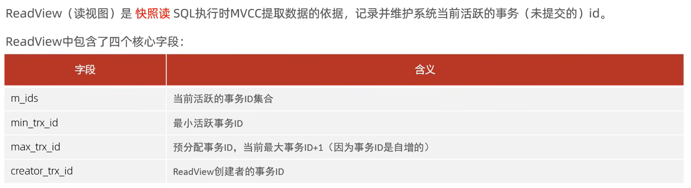
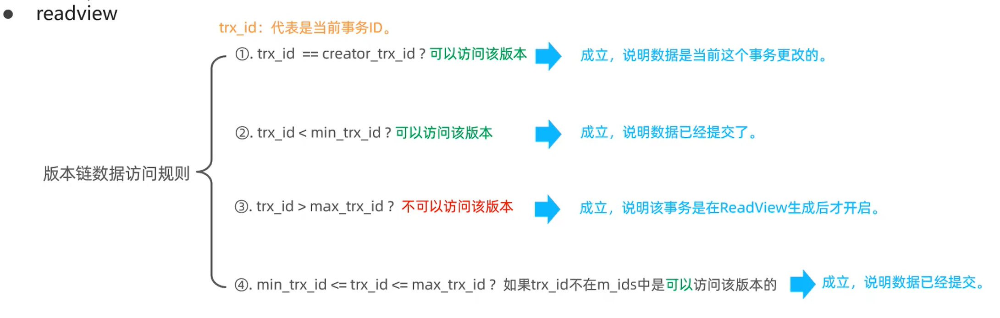
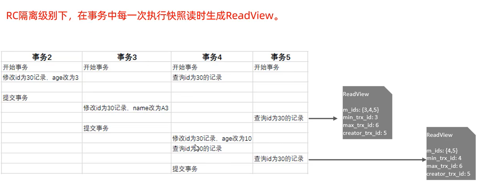
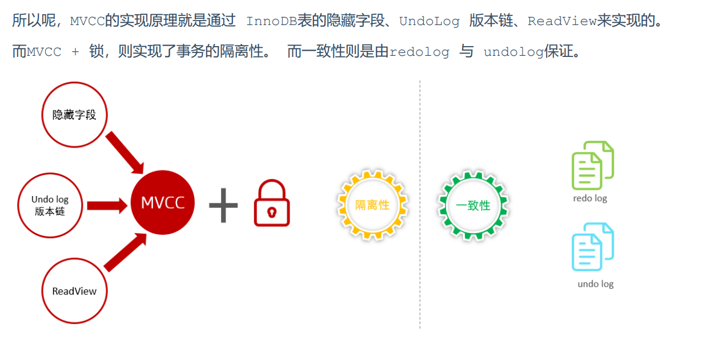

## 概念

### 当前读

窗口A开启事务，窗口B进行插入操作，窗口A执行select，发现找不到窗口B新加的那条数据

如果在开启事务的窗口A想查到最新的数据，可以加上lock in share mode

加锁的读都是当前读，例如

select ... lock in share mode(共享锁)，select ... for update、update、insert、delete(排他锁)都是一种当前读。

```mysql
select * from stu lock in share mode;
```

### 快照读

简单的select（不加锁）就是快照读，快照读，读取的是记录数据的可见版本，有可能是历史数据， 不加锁，是非阻塞读。

* Read Committed：每次select，都生成一个快照读。

* Repeatable Read：开启事务后第一个select语句才是快照读的地方。 

* Serializable：快照读会退化为当前读。

### MVCC

全称 Multi-Version Concurrency Control，多版本并发控制。指维护一个数据的多个版本， 使得读写操作没有冲突，快照读为MySQL实现MVCC提供了一个非阻塞读功能。MVCC的具体实现，还需 要依赖于数据库记录中的三个隐式字段、undo log日志、readView。


## 隐藏字段




## undo log

回滚日志，在insert、update、delete的时候产生的便于数据回滚的日志。 当insert的时候，产生的undo log日志只在回滚时需要，在事务提交后，可被立即删除。 而update、delete的时候，产生的undo log日志不仅在回滚时需要，在快照读时也需要，不会立即 被删除。


### 版本链



### readview







大概意思就是通过这个readview，去找版本链，去寻找应该返回数据的哪个版本


## 总结



